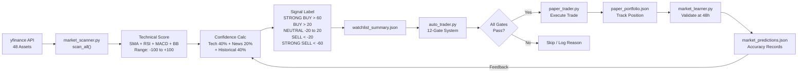
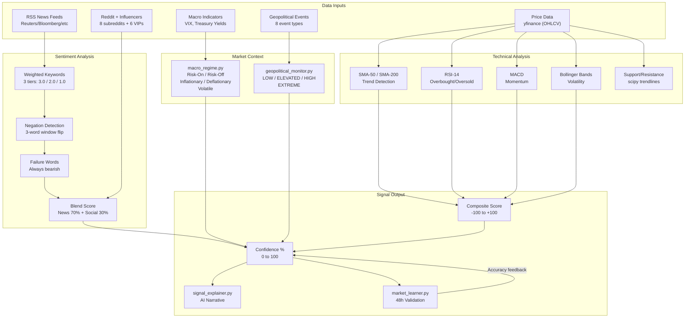
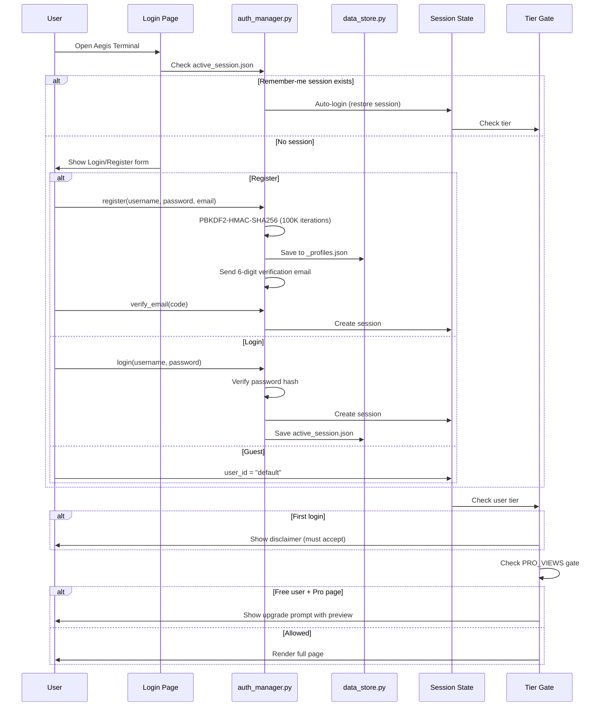
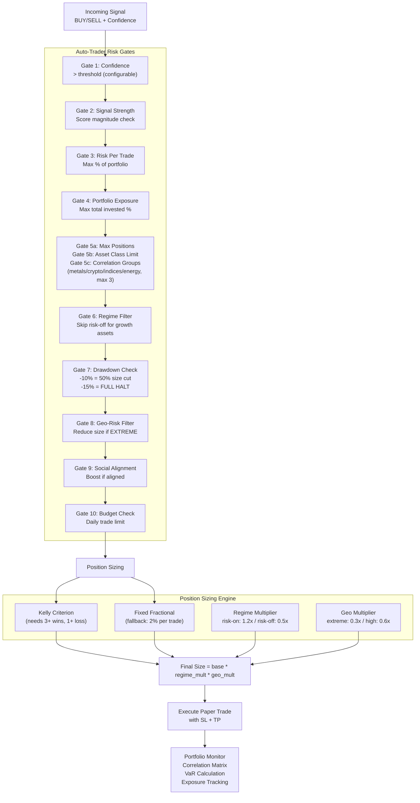
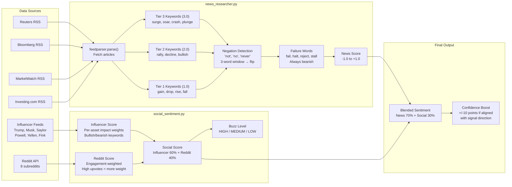

# Aegis Trading Terminal — Architecture Diagrams
> 10 Mermaid diagrams documenting every system component

---

## 1. System Overview

```mermaid
flowchart TD
    subgraph Frontend["Frontend Layer"]
        APP["dashboard/app.py<br/>Streamlit ~8630 lines<br/>28 views"]
        LAND["landing/index.html<br/>Static Landing Page"]
    end

    subgraph Backend["Backend Engine (src/)"]
        BRAIN["aegis_brain.py<br/>Orchestration Loop"]
        SCAN["market_scanner.py<br/>Signal Scoring"]
        AUTO["auto_trader.py<br/>12-Gate Decision Engine"]
        NEWS["news_researcher.py<br/>RSS Sentiment"]
        SOCIAL["social_sentiment.py<br/>Influencer + Reddit"]
        LEARN["market_learner.py<br/>Prediction Tracking"]
        RISK["risk_manager.py<br/>Position Sizing + VaR"]
        CHART["chart_engine.py<br/>Technical Indicators"]
        PAPER["paper_trader.py<br/>Portfolio Simulation"]
        EXPLAIN["signal_explainer.py<br/>AI Explanations"]
        MACRO["macro_regime.py<br/>Risk-On/Off Detection"]
        GEO["geopolitical_monitor.py<br/>Geo Event Impact"]
        ECON["economic_calendar.py<br/>FOMC/NFP/CPI Events"]
        BRIEF["morning_brief.py<br/>Daily Summary"]
        OPT["portfolio_optimizer.py<br/>Mean-Variance"]
        PERF["performance_analytics.py<br/>Sharpe/Drawdown/Charts"]
    end

    subgraph Data["Data Layer"]
        JSON["JSON Files<br/>src/data/ + memory/"]
        STORE["data_store.py<br/>Atomic Read/Write"]
    end

    subgraph External["External APIs"]
        YF["yfinance<br/>Market Data (delayed)"]
        RSS["RSS Feeds<br/>News Sources"]
        REDDIT["Reddit JSON API<br/>Social Buzz"]
        LLM["OpenAI / Anthropic<br/>LLM Explanations (optional)"]
    end

    subgraph Auth["Auth & Config"]
        AUTH["auth_manager.py<br/>Login/Register/Tiers"]
        CONFIG["config.py<br/>Settings Pipeline"]
        I18N["i18n.py<br/>3 Languages + RTL"]
    end

    APP --> BRAIN
    APP --> SCAN
    APP --> AUTO
    APP --> PAPER
    APP --> CHART
    APP --> NEWS
    APP --> PERF

    BRAIN --> SCAN
    BRAIN --> AUTO
    BRAIN --> LEARN
    BRAIN --> SOCIAL
    BRAIN --> GEO
    BRAIN --> MACRO

    SCAN --> YF
    NEWS --> RSS
    SOCIAL --> REDDIT
    EXPLAIN --> LLM

    SCAN --> STORE
    AUTO --> STORE
    PAPER --> STORE
    LEARN --> STORE
    STORE --> JSON

    APP --> AUTH
    APP --> CONFIG
    APP --> I18N
```

---

## 2. Trading Pipeline

---

## 3. AI/ML Pipeline

---

## 4. Data Flow — JSON Files

```mermaid
flowchart TD
    subgraph Writers["Writer Modules"]
        W_SCAN["market_scanner.py"]
        W_AUTO["auto_trader.py"]
        W_PAPER["paper_trader.py"]
        W_LEARN["market_learner.py"]
        W_NEWS["news_researcher.py"]
        W_SOCIAL["social_sentiment.py"]
        W_BRAIN["aegis_brain.py"]
        W_AUTH["auth_manager.py"]
        W_ALERT["alert_manager.py"]
        W_CHIEF["chief_monitor.py"]
        W_SETT["Settings Page (app.py)"]
    end

    subgraph JSON["JSON Data Files"]
        WS["src/data/watchlist_summary.json<br/>48 asset signals + scores"]
        UW["src/data/user_watchlist.json<br/>Active asset list"]
        WL["src/data/watchlists/<br/>Named watchlist files"]
        SC["src/data/social_sentiment.json<br/>Social scores cache"]
        NC["src/data/news_cache.json<br/>RSS cache"]
        SE["src/data/signal_explanations.json<br/>AI explanation cache"]
        PP["memory/paper_portfolio.json<br/>Open positions + cash"]
        MP["memory/market_predictions.json<br/>Prediction tracking"]
        BA["memory/bot_activity.json<br/>Last 200 cycles"]
        BS["memory/bot_schedule.json<br/>Auto-scheduler config"]
        EL["memory/error_lessons.json<br/>AI learning"]
        ML["memory/market_lessons.json<br/>Market patterns"]
        DR["memory/daily_reflections.json<br/>Chief monitor output"]
        SO["src/data/settings_override.json<br/>User preferences"]
        UP["users/_profiles.json<br/>User accounts"]
        US["users/_sessions.json<br/>Active sessions"]
        UA["users/_active_session.json<br/>Remember-me"]
    end

    W_SCAN --> WS
    W_SCAN --> UW
    W_AUTO --> PP & BA
    W_PAPER --> PP
    W_LEARN --> MP
    W_NEWS --> NC
    W_SOCIAL --> SC
    W_BRAIN --> BA & EL & ML
    W_AUTH --> UP & US & UA
    W_CHIEF --> DR
    W_SETT --> SO
    W_ALERT --> BA

    subgraph Readers["Key Readers"]
        R_APP["dashboard/app.py<br/>Reads ALL files"]
        R_AUTO["auto_trader.py<br/>Reads WS, PP, SO, BA"]
        R_SCAN["market_scanner.py<br/>Reads UW, SO"]
        R_LEARN["market_learner.py<br/>Reads WS, MP"]
    end

    WS --> R_APP & R_AUTO & R_LEARN
    PP --> R_APP & R_AUTO
    UW --> R_SCAN & R_APP
    SO --> R_AUTO & R_SCAN
```

---

## 5. Authentication Flow

---

## 6. Dashboard Navigation — 28 Views

```mermaid
flowchart TD
    subgraph Trading["TRADING (green #3fb950)"]
        ADV["💡 Daily Advisor<br/>(DEFAULT landing)"]
        MB["☀️ Morning Brief"]
        WL["📊 Watchlist Overview"]
        CH["📈 Advanced Charts"]
        PT["💼 Paper Trading"]
        TJ["📓 Trade Journal"]
        WM["📋 Watchlist Manager"]
        AL["🔔 Alerts"]
        AD["🔍 Asset Detail<br/>(contextual - not in sidebar)"]
    end

    subgraph Intelligence["INTELLIGENCE (blue #58a6ff)"]
        NI["🌍 News Intelligence"]
        EC["📅 Economic Calendar"]
        RC["🎯 Signal Report Card"]
        FU["📊 Fundamentals"]
        SL["🧪 Strategy Lab 🔒PRO"]
        AN["📉 Analytics"]
        RD["🛡️ Risk Dashboard"]
        OP["⚖️ Optimizer 🔒PRO"]
        MO["🌐 Market Overview"]
    end

    subgraph System["SYSTEM (gray #6e7681)"]
        KB["📋 Kanban"]
        EV["🧬 Evolution"]
        PF["📊 Performance"]
        MN["🤖 Monitor"]
        BU["💰 Budget"]
        LG["📝 Logs"]
        ST["⚙️ Settings"]
    end

    subgraph Account["ACCOUNT"]
        LOGIN["🔐 Login/Register"]
    end

    LOGIN -->|"Authenticated"| ADV
    ADV -->|"Asset click"| AD
    WL -->|"Asset click"| AD
    PT -->|"Asset click"| AD
    AD -->|"Chart tab"| CH
    AD -->|"News tab"| NI
    ADV -->|"Quick LONG"| PT

    style Trading fill:#0d1117,stroke:#3fb950
    style Intelligence fill:#0d1117,stroke:#58a6ff
    style System fill:#0d1117,stroke:#6e7681
```

---

## 7. Autonomous Loop (aegis_brain.py)

```mermaid
flowchart LR
    START["⏰ Scheduled Trigger<br/>Every 5-60 min"] --> S1

    S1["Step 1: SCAN<br/>market_scanner.scan_all()<br/>48 assets scored"] --> S2

    S2["Step 2: SOCIAL<br/>social_sentiment.scan()<br/>Influencers + Reddit"] --> S3

    S3["Step 3: SIGNALS<br/>Generate BUY/SELL<br/>with confidence"] --> S375

    S375["Step 3.75: ALERTS<br/>alert_manager.check_alerts()<br/>Price/signal triggers"] --> S4

    S4["Step 4: AUTO-TRADE<br/>auto_trader.evaluate()<br/>12-gate decision"] --> S5

    S5["Step 5: VALIDATE<br/>market_learner.validate()<br/>48h prediction check"] --> S6

    S6["Step 6: DISCOVER<br/>market_discovery.scan()<br/>Extended assets"] --> S7

    S7["Step 7: REFLECT<br/>chief_monitor.daily_check()<br/>Health + Lessons"] --> S8

    S8["Step 8: LEARN<br/>Save error_lessons<br/>+ market_lessons"] --> S9

    S9["Step 9: LOG<br/>bot_activity.json<br/>Last 200 cycles"] --> WAIT

    WAIT["💤 Wait for<br/>next interval"] --> START

    style S1 fill:#238636
    style S4 fill:#da3633
    style S5 fill:#58a6ff
    style S7 fill:#6e7681
```

---

## 8. Risk Management

---

## 9. News & Sentiment Pipeline

---

## 10. Infrastructure — Current vs Target

```mermaid
flowchart TD
    subgraph Current["CURRENT STACK (v6.0)"]
        C_FE["Streamlit<br/>Single-process<br/>~8630 line app.py"]
        C_BE["Python Scripts<br/>Monolithic modules<br/>No API layer"]
        C_DB["JSON Files<br/>No database<br/>File-based locking"]
        C_DATA["yfinance<br/>Delayed 15-20min<br/>Unreliable"]
        C_HOST["Local / Single VPS<br/>No containerization<br/>Manual deploy"]
        C_MON["None<br/>No monitoring<br/>No alerting"]
    end

    subgraph Phase1["PHASE 1: Foundation (Month 1-3)"]
        P1_FE["Streamlit (keep)<br/>+ FastAPI REST layer"]
        P1_DB["PostgreSQL + Redis<br/>Replace JSON files"]
        P1_CI["GitHub Actions<br/>Docker + docker-compose"]
        P1_MON["Sentry + UptimeRobot<br/>Basic error tracking"]
        P1_DATA["Twelve Data API<br/>Real-time WebSocket"]
    end

    subgraph Phase2["PHASE 2: Scale (Month 4-6)"]
        P2_FE["React + TypeScript<br/>Component library"]
        P2_BE["FastAPI Microservices<br/>Signal / Trading / User"]
        P2_INFRA["Kubernetes (EKS)<br/>Auto-scaling"]
        P2_Q["Celery + Redis<br/>Background task queue"]
        P2_MON["Datadog APM<br/>Full observability"]
    end

    subgraph Phase3["PHASE 3: Production (Month 7-12)"]
        P3_FE["React + React Native<br/>Web + iOS + Android"]
        P3_BE["Microservices<br/>+ Kafka Event Stream"]
        P3_INFRA["Multi-Region<br/>US + EU + Asia"]
        P3_DB["PostgreSQL + Redis<br/>+ Snowflake DW"]
        P3_ML["MLflow + Feature Store<br/>Model Registry"]
        P3_CDN["CloudFront CDN<br/>Sub-100ms globally"]
    end

    Current -->|"$5K/mo"| Phase1
    Phase1 -->|"$15K/mo"| Phase2
    Phase2 -->|"$50K/mo"| Phase3

    style Current fill:#da3633,color:#fff
    style Phase1 fill:#d29922,color:#fff
    style Phase2 fill:#58a6ff,color:#fff
    style Phase3 fill:#238636,color:#fff
```

