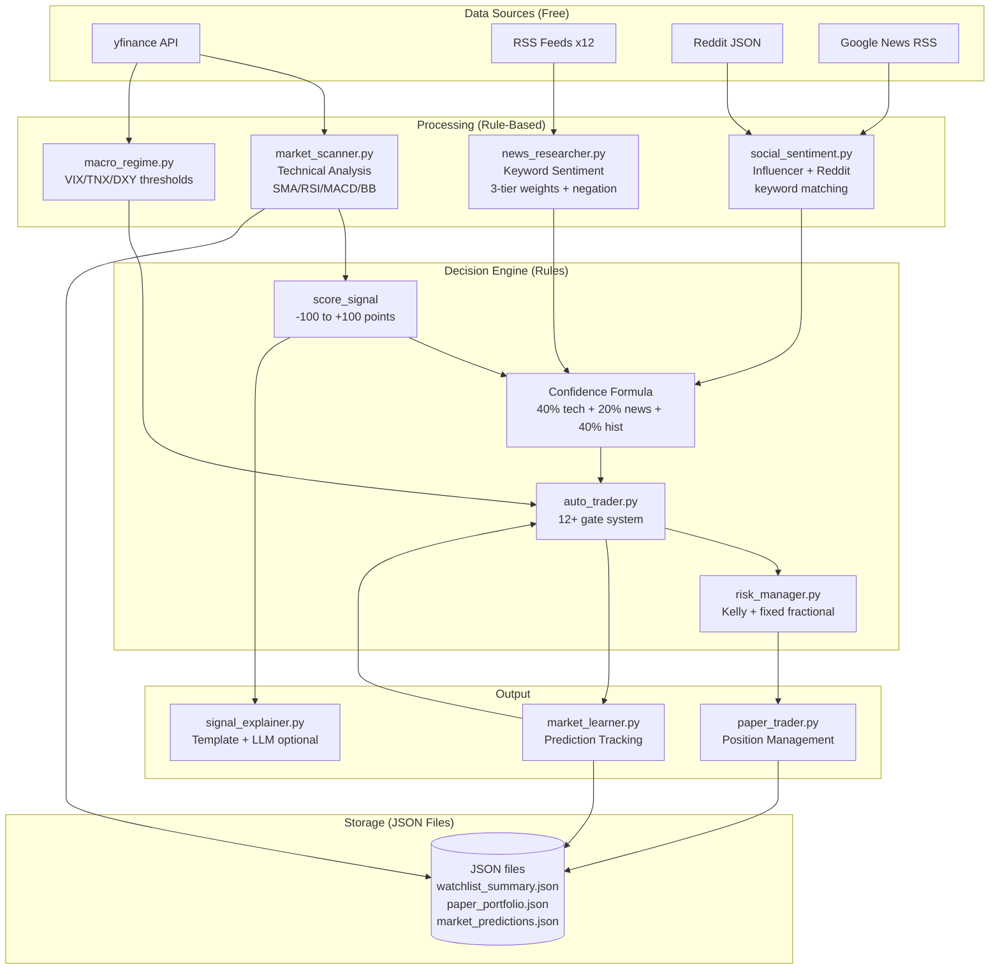
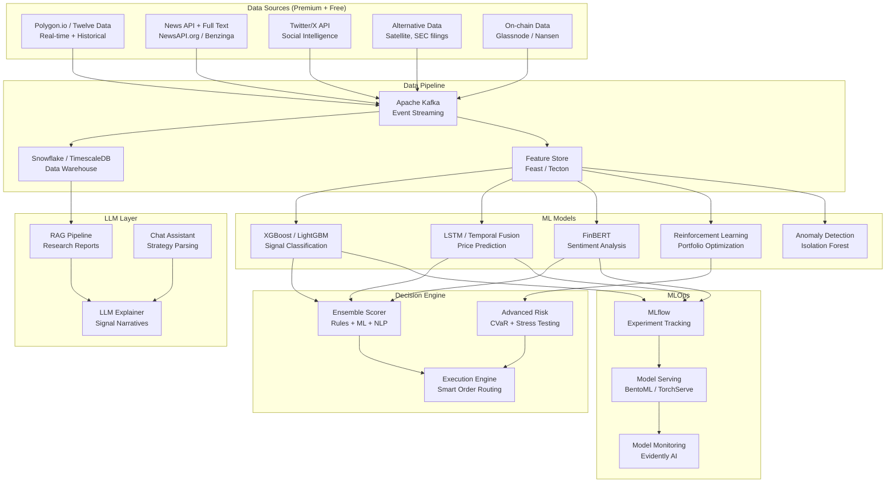

# Project Aegis -- Data & AI Strategy Report

**Version:** 1.0
**Date:** 2026-02-28
**Scope:** AI/ML capabilities assessment, architecture evolution roadmap, and data infrastructure plan

---

## Table of Contents

1. [Current AI/ML Capabilities](#1-current-aiml-capabilities)
2. [AI Architecture: Current vs Target](#2-ai-architecture-current-vs-target)
3. [ML Model Strategy](#3-ml-model-strategy)
4. [Data Infrastructure Roadmap](#4-data-infrastructure-roadmap)
5. [LLM Integration Strategy](#5-llm-integration-strategy)
6. [KPIs](#6-kpis)

---

## 1. Current AI/ML Capabilities

### 1.1 Component Inventory

#### Signal Scoring Engine (`src/market_scanner.py`)
**Maturity: 2/5 -- Rule-Based with Domain Expertise**

The core signal scoring in `score_signal()` (line 350+) uses a hand-crafted point system:

| Indicator | Scoring Rule | Max Points |
|-----------|-------------|------------|
| Proximity to support | Within 2% -> +25, within 5% -> +15, within 10% -> +5 | +25 |
| Golden cross (SMA-50 > SMA-200) | Present -> +20 | +20 |
| RSI-14 zones | < 30 (oversold) -> +15, < 45 -> +10, < 60 -> +5, > 70 -> -10 | +15 / -10 |
| MACD momentum | Bullish (MACD > signal) -> +10, bearish -> -5 | +10 / -5 |
| Bollinger Bands | Near lower band -> +10, near upper band -> -5 | +10 / -5 |
| Volume confirmation | Volume ratio > 1.5 -> +5 | +5 |

**Score range:** -100 to +100
**Signal labels:** STRONG BUY (>= 60), BUY (>= 30), NEUTRAL (-29 to +29), SELL (<= -30), STRONG SELL (<= -60)

**Confidence formula** (from `config.py` `SignalConfig`):
```
confidence = 0.40 * technical_score_normalized
           + 0.20 * news_sentiment_normalized
           + 0.40 * historical_accuracy
```

**Multi-timeframe analysis** (`analyze_multi_timeframe()`, line 265): Fetches 4H data, computes 4H RSI/MACD/SMA-20, produces bullish/bearish confirmation counts. Used as a confidence modifier badge on Advisor cards.

**Strengths:** Interpretable, fast, no API cost, covers multiple technical indicators.
**Weaknesses:** Fixed thresholds, no adaptation to market regimes (handled separately), no feature interaction, no cross-asset signal correlation, equal weighting of indicators ignores their relative predictive power.

---

#### News Sentiment Engine (`src/news_researcher.py`)
**Maturity: 2/5 -- Weighted Keyword Matching with Negation**

Scoring method in `score_headline()` (line 130):
- **3-tier weighted keywords**: 50 bullish words (weights 1.0-3.0), 40 bearish words (weights 1.0-3.0)
- **Negation detection** (`_has_negation_before()`): Checks 3 words before a keyword for negators (`not`, `no`, `never`, `unlikely`, etc.). Negated bullish becomes mild bearish (50% weight), and vice versa.
- **Failure words**: `fail`, `halt`, `reject`, `stall` always bearish regardless of context.
- **Asset keyword mapping**: 12+ core assets + 20 US stocks + more, each with ~5-10 relevance keywords (line 170+).

**Score normalization:** `raw = (bull_score - bear_score) / total` clamped to [-1.0, 1.0]

**Data sources:** yfinance ticker news, 12+ RSS feeds (CNBC, MarketWatch, Reuters, Bloomberg, FT, WSJ, NYT, BBC, Guardian, CoinDesk, CoinTelegraph, Kitco, Google News).

**Blended sentiment:** news 70% + social sentiment 30% (integrated in signal pipeline).

**Strengths:** Zero cost, covers multiple source types, negation detection avoids simple false positives.
**Weaknesses:** Keyword matching misses context ("Goldman Sachs" triggers "Gold"), no sarcasm detection, headline-only (no article body), no entity disambiguation, fixed keyword list requires manual updates, no temporal decay (yesterday's news weighted same as 1-hour-old news).

---

#### Social Sentiment Engine (`src/social_sentiment.py`)
**Maturity: 2/5 -- Influencer Tracking + Reddit Scraping**

**Influencer tracking** (6 individuals):
- Trump, Elon Musk, Michael Saylor, Jerome Powell, Janet Yellen, Larry Fink
- Per-influencer: asset impact weights (0.5-3.0), bullish/bearish keyword sets
- Data source: Google News RSS for each influencer name

**Reddit parsing** (8 subreddits):
- r/wallstreetbets, r/CryptoCurrency, r/stocks, r/investing, r/Gold, r/Bitcoin, r/ethereum, r/Commodities
- Engagement-weighted scoring: high-upvote posts count more
- 0.5s delay between subreddits to avoid rate limiting
- Free JSON endpoint (no API key)

**Scoring blend:** influencer 60% + Reddit 40%
**Buzz levels:** HIGH/MEDIUM/LOW based on mention velocity
**Confidence boost:** +/-10 points when social aligns with signal direction

**Strengths:** Captures market-moving influencer impact, Reddit covers retail sentiment.
**Weaknesses:** Google News as Twitter proxy is unreliable, Reddit JSON endpoint is unofficial and fragile, no NLP on post content (just keyword matching), no bot detection, no historical social data, User-Agent spoofing may trigger blocks.

---

#### Signal Explainer (`src/signal_explainer.py`)
**Maturity: 2/5 -- Template Engine with Optional LLM**

**Template mode** (`generate_template_explanation()`, line 55): Rule-based sentence generation combining:
- Signal direction and confidence
- RSI context (oversold/overbought/neutral)
- Technical alignment (bullish/bearish/mixed based on score)
- News + social context (bullish/bearish + buzz level)
- Macro regime description (Risk-On/Off/Inflationary/etc.)
- Geopolitical risk level
- Target/stop-loss with upside/downside percentages

**LLM mode** (`generate_llm_explanation()`, line 163): Optional, requires API keys:
- **OpenAI**: GPT-4o-mini, 200 max tokens, temperature 0.7
- **Anthropic**: Claude 3.5 Haiku, 200 max tokens
- Prompt includes all signal data in structured format
- 15-second timeout, falls back to None on any error
- Cache: 30-minute TTL per asset in `signal_explanations.json`

**Strengths:** Works without any API key (template mode), LLM mode produces rich narratives.
**Weaknesses:** Template mode is formulaic and repetitive, LLM mode silently fails on errors, no streaming, no prompt versioning, no A/B testing of explanation quality.

---

#### Prediction Tracker (`src/market_learner.py`)
**Maturity: 2/5 -- Threshold-Based Validation**

**Prediction recording** (`record_prediction()`, line 124): Archives every signal with entry price, target, stop-loss, RSI, MACD, golden cross, volatility, and news sentiment.

**Validation logic** (`validate_all()`, line 167):
- Waits `MIN_VALIDATION_HOURS` (1h) before checking
- BUY correct: price >= target. BUY incorrect: price <= stop-loss.
- SELL correct: price <= target. SELL incorrect: price >= stop-loss.
- Time-based fallback at 48h: checks percentage move direction
- Success thresholds from `ValidationConfig`: BUY needs +1%, SELL needs -1%

**Learning from failure** (`_learn_from_failure()`): Creates a lesson entry when a prediction is wrong. Lessons stored in `market_lessons.json`.

**Performance stats** (`get_performance_stats()`): Win rate, total predictions, per-asset breakdown. Used by `auto_trader.py` for dynamic confidence adjustment (Gate 2).

**Strengths:** Closes the feedback loop, per-asset tracking enables adaptive confidence.
**Weaknesses:** Validation is still rule-based (not ML), no feature importance analysis, no Bayesian updating, lessons are stored but not systematically used to retrain anything.

---

#### Macro Regime Detector (`src/macro_regime.py`)
**Maturity: 2/5 -- Indicator Thresholds**

**Indicators fetched:** VIX (`^VIX`), 10Y Treasury yield (`^TNX`), DXY (`DX-Y.NYB`), Gold/SPX ratio.
**Regime classification:** Based on indicator levels and trends (rising/falling/flat over 20 days).
**6 regimes:** RISK_ON, RISK_OFF, INFLATIONARY, DEFLATIONARY, HIGH_VOLATILITY, NEUTRAL.

**Per-regime asset multipliers** (`REGIME_MULTIPLIERS`, line 28-71): Each regime defines a multiplier (0.70-1.30) for each of the 12 assets. These flow into `auto_trader.py` position sizing.

**Strengths:** Macro context prevents trading against the tide, multipliers are well-calibrated.
**Weaknesses:** Hardcoded thresholds, no ML classification, no regime transition detection, no confidence score on regime label, single-point indicators (no probabilistic assessment).

---

### 1.2 Maturity Summary

| Component | Current Approach | Maturity | Accuracy Estimate |
|-----------|-----------------|----------|-------------------|
| Signal scoring | Hand-crafted point system | 2/5 | ~50-55% (random + slight edge) |
| News sentiment | Weighted keywords + negation | 2/5 | ~60-65% on clear headlines |
| Social sentiment | Influencer keywords + Reddit | 2/5 | ~55-60% |
| Signal explainer | Template + optional LLM | 2/5 | N/A (narrative quality) |
| Prediction tracking | Threshold validation | 2/5 | Tracking accuracy, not prediction |
| Macro regime | Indicator thresholds | 2/5 | ~60-65% regime classification |
| Portfolio optimizer | Mean-variance (scipy) | 3/5 | Mathematically sound, data-limited |
| Auto-trader | 12+ gate decision engine | 3/5 | Conservative but not adaptive |

**Overall AI Maturity: 2.1 / 5.0** -- Rule-based system with domain expertise. No machine learning, no model training, no feature engineering, no data pipeline beyond JSON files.

---

## 2. AI Architecture: Current vs Target

### 2.1 Current Architecture



### 2.2 Target Architecture (18-24 months)



### 2.3 Migration Path (4 Phases)

| Phase | Timeline | From | To | Key Change |
|-------|----------|------|----|------------|
| **Phase 1: Foundation** | Months 1-3 | JSON files, yfinance | PostgreSQL + Redis, Polygon.io | Reliable data layer |
| **Phase 2: First ML** | Months 4-9 | Rule-based scoring | XGBoost + FinBERT | ML replaces hand-crafted rules |
| **Phase 3: Deep Learning** | Months 10-15 | XGBoost | LSTM + Transformer ensemble | Temporal pattern recognition |
| **Phase 4: Full AI** | Months 16-24 | Static models | RL + RAG + continuous learning | Adaptive, self-improving system |

---

## 3. ML Model Strategy

### 3.1 Signal Prediction

#### Phase 1: XGBoost Gradient Boosting (Months 4-6)

**Why XGBoost first:**
- Works well with tabular financial data
- Handles missing values natively (yfinance gaps)
- Feature importance is interpretable (regulatory requirement)
- Fast training, can retrain nightly
- Proven in financial ML competitions

**Feature engineering from existing data:**

| Feature Category | Features | Source |
|-----------------|----------|--------|
| Technical | SMA ratios (50/200, 20/50), RSI-14, MACD histogram, BB width, volume ratio | `market_scanner.py` `analyze_asset()` |
| Momentum | Rate of change (5d, 10d, 20d), ATR, ADX (new) | Derived from yfinance data |
| Sentiment | News score, social score, buzz level, influencer count | `news_researcher.py`, `social_sentiment.py` |
| Macro | VIX level, VIX change, DXY trend, yield curve slope | `macro_regime.py` |
| Calendar | Day of week, month, days to FOMC, days to NFP | `economic_calendar.py` |
| Cross-asset | Gold/SPX ratio, BTC/ETH correlation, commodity index | New feature |
| Historical | Win rate (7d, 30d), avg signal score, prediction accuracy | `market_learner.py` |

**Target variable:** Binary classification (price up > 1% in 48h = 1, else 0)
**Training data:** Backfill from market_predictions.json + yfinance historical
**Validation:** Walk-forward validation (train on 6 months, test on next month, slide)
**Retraining cadence:** Weekly with latest data

**Integration point:** Replace `score_signal()` hard-coded points with XGBoost probability. Keep rule-based as fallback and for explainability.

```python
# Proposed integration in market_scanner.py
def score_signal_v2(name: str, tech: dict, config: dict, model=None) -> dict:
    if model:
        features = _extract_features(tech, name)
        ml_prob = model.predict_proba([features])[0][1]  # P(price_up)
        ml_score = (ml_prob - 0.5) * 200  # Map [0,1] to [-100, +100]
        rule_score = score_signal_v1(name, tech, config)["score"]  # Legacy
        # Blend: 70% ML + 30% rules (transition period)
        final_score = 0.7 * ml_score + 0.3 * rule_score
    else:
        final_score = score_signal_v1(name, tech, config)["score"]
```

#### Phase 2: LSTM Sequence Model (Months 7-12)

**Architecture:** Bidirectional LSTM with attention
- Input: 60-day window of daily OHLCV + indicators (20+ features)
- Hidden layers: 2 LSTM layers (128, 64 units)
- Output: 3-class classification (UP > 2%, DOWN < -2%, NEUTRAL)
- Dropout: 0.3 between layers

**Advantages over XGBoost:**
- Captures temporal dependencies (trend acceleration, pattern recognition)
- Learns from sequence of prices, not just point-in-time snapshot
- Better at regime transitions

**Training requirements:**
- Minimum 2 years of daily data per asset (available via yfinance)
- GPU recommended for training (CPU fine for inference)
- ~10 minutes training per asset on modern GPU

#### Phase 3: Temporal Fusion Transformer (Months 13-18)

**Architecture:** Google's TFT (Temporal Fusion Transformer)
- Multi-horizon forecasting (1d, 3d, 7d, 14d)
- Static covariates: asset class, sector, market cap
- Time-varying known: calendar features, scheduled events
- Time-varying unknown: price, volume, sentiment
- Interpretable attention weights

**Why TFT:**
- State-of-the-art for multi-step financial forecasting
- Built-in variable selection (automatic feature importance)
- Handles multiple prediction horizons simultaneously
- Attention maps provide explainability

### 3.2 NLP: Sentiment Analysis

#### Phase 1: Current Keywords (Months 1-3) -- Keep as baseline

Current `score_headline()` with weighted keywords + negation. Establish ground-truth labeling pipeline.

#### Phase 2: FinBERT (Months 4-9)

**Model:** ProsusAI/finbert (pre-trained on financial text)
**Fine-tuning data:**
- Labeled headlines from current news cache (use rule-based labels as weak supervision)
- Financial PhraseBank (4,845 sentences, human-labeled)
- Manual labeling of 500 Aegis-specific headlines (asset-specific context)

**Integration:**
```python
# Proposed replacement for score_headline() in news_researcher.py
from transformers import AutoTokenizer, AutoModelForSequenceClassification

class FinBERTSentiment:
    def __init__(self):
        self.tokenizer = AutoTokenizer.from_pretrained("ProsusAI/finbert")
        self.model = AutoModelForSequenceClassification.from_pretrained("ProsusAI/finbert")

    def score(self, headline: str) -> float:
        inputs = self.tokenizer(headline, return_tensors="pt", truncation=True, max_length=128)
        outputs = self.model(**inputs)
        probs = torch.softmax(outputs.logits, dim=1)
        # FinBERT: [positive, negative, neutral]
        return float(probs[0][0] - probs[0][1])  # [-1.0, 1.0]
```

**Inference cost:** ~5ms per headline on CPU, ~1ms on GPU
**Batch processing:** Score all headlines for an asset in one batch (~50-100 headlines)

**Advantages over keywords:**
- Understands context ("Goldman Sachs" won't trigger "Gold")
- Handles negation, sarcasm, and complex sentence structure
- Pre-trained on financial domain
- 80-85% accuracy on financial sentiment (vs ~60-65% keyword)

#### Phase 3: Custom Fine-Tuned Model (Months 10-15)

Fine-tune on Aegis-specific data:
- Asset-specific sentiment (what's bullish for Gold may be bearish for S&P)
- Influencer-specific weighting
- Multi-label: sentiment + topic + urgency + impact magnitude
- Training on article full-text (not just headlines)

### 3.3 Portfolio Optimization

#### Current: Mean-Variance (`src/portfolio_optimizer.py`)

Uses scipy SLSQP with constraints:
- Max Sharpe ratio, Min variance, Equal weight, Half-Kelly strategies
- 6-month historical returns via yfinance
- Efficient frontier with 50 points
- Allocation bar charts + pie charts via Plotly

**Maturity: 3/5** -- Mathematically correct but limited by:
- Historical returns only (no forward-looking views)
- No transaction costs
- Assumes normal distribution of returns
- No rebalancing strategy

#### Phase 2: Black-Litterman Model (Months 7-12)

Incorporate market views (signals) into portfolio optimization:
- Equilibrium returns from market cap weights
- Aegis signal scores as investor views with confidence
- Blended expected returns that combine market consensus + Aegis signals
- Handles uncertainty in views (low confidence = less weight)

**Integration with existing system:**
```python
# signal scores -> Black-Litterman views
views = {}
for asset, scan in scan_results.items():
    confidence_pct = scan["confidence"]["confidence_pct"]
    if confidence_pct > 60:  # Only use high-confidence signals
        expected_return = scan["signal"]["score"] / 100 * 0.20  # Scale to annual return
        views[asset] = (expected_return, 1 - confidence_pct/100)  # (view, uncertainty)
```

#### Phase 3: Reinforcement Learning (Months 13-24)

**Agent:** PPO (Proximal Policy Optimization)
**State space:** Current portfolio weights, asset features, macro indicators
**Action space:** Continuous weight adjustments per asset
**Reward function:** Risk-adjusted return (Sharpe ratio) - transaction costs
**Training:** On 5+ years of historical data with walk-forward validation

**Advantages:**
- Learns optimal rebalancing timing
- Handles transaction costs and slippage
- Adapts to changing market conditions
- Can learn non-linear portfolio interactions

---

## 4. Data Infrastructure Roadmap

### 4.1 Current State: JSON Files

```
Storage: Local JSON files (~30 files across src/data/ and memory/)
Throughput: ~10 reads/sec, ~5 writes/sec (file I/O bound)
Concurrency: threading.Lock per file path (single-process only)
Backup: None (user data loss on disk failure)
Query: Full file load + Python dict traversal
Scale limit: ~10 concurrent users before file corruption risk
```

### 4.2 Phase 1: PostgreSQL + Redis (Months 1-3)

**PostgreSQL (primary storage):**
```sql
-- Core tables
users (id, email, password_hash, salt, tier, created_at, verified)
portfolios (id, user_id, cash, starting_balance, created_at)
positions (id, portfolio_id, asset, ticker, direction, amount, entry_price, ...)
trade_history (id, portfolio_id, asset, direction, pnl, entry_time, exit_time, ...)
predictions (id, asset, signal_label, score, entry_price, target, outcome, ...)
market_lessons (id, prediction_id, lesson_text, created_at)
settings (user_id, key, value, updated_at)

-- Market data tables
watchlist_summary (asset, ticker, price, signal, confidence, updated_at)
social_sentiment (asset, score, buzz_level, influencer_data, updated_at)
news_cache (id, asset, headline, source, sentiment_score, published_at)
macro_regime (regime, indicators, multipliers, detected_at)
```

**Redis (caching + real-time):**
```
live_prices:{ticker} -> {price, timestamp}     TTL: 60s
scan_results:{asset} -> {full scan JSON}       TTL: 300s
social_cache:{asset} -> {social data JSON}     TTL: 600s
session:{token} -> {user_id, tier, expires}    TTL: 24h
rate_limit:login:{ip} -> {attempts}            TTL: 900s
```

**Migration strategy:**
- `data_store.py` already provides an abstraction layer -- swap JSON backend for PostgreSQL
- `DataStore.load_user_data()` / `save_user_data()` interface stays the same
- Atomic writes via PostgreSQL transactions (replace file temp+rename)
- Run dual-write (JSON + PostgreSQL) for 2 weeks, then cut over

### 4.3 Phase 2: Kafka Event Streaming (Months 4-6)

**Topics:**
```
aegis.market.prices        -- Real-time price ticks
aegis.market.signals       -- Generated signals (scored)
aegis.news.raw             -- Raw news articles
aegis.news.sentiment       -- Scored sentiment
aegis.social.raw           -- Social media mentions
aegis.trades.executed      -- Trade executions
aegis.predictions.created  -- New predictions
aegis.predictions.validated -- Validated outcomes
```

**Benefits:**
- Decouple scanner from dashboard (async processing)
- Enable real-time signal streaming to 10K users
- Event sourcing for complete audit trail
- Replay capability for backtesting

### 4.4 Phase 3: Data Warehouse + Feature Store (Months 7-12)

**Snowflake / TimescaleDB:**
- Historical price data (tick-level for backtesting)
- Aggregated sentiment time series
- Feature engineering pipelines (scheduled dbt transforms)
- ML training data snapshots

**Feature Store (Feast):**
```python
# Feature definitions
price_features = FeatureView(
    entities=["asset"],
    features=[
        Feature("sma_50", Float64),
        Feature("sma_200", Float64),
        Feature("rsi_14", Float64),
        Feature("macd_histogram", Float64),
        Feature("bb_width", Float64),
        Feature("volume_ratio", Float64),
    ],
    ttl=timedelta(hours=1),
)

sentiment_features = FeatureView(
    entities=["asset"],
    features=[
        Feature("news_score", Float64),
        Feature("social_score", Float64),
        Feature("buzz_level", String),
        Feature("influencer_count", Int64),
    ],
    ttl=timedelta(hours=4),
)
```

**Benefits:**
- Consistent features between training and serving (no training/serving skew)
- Point-in-time correctness for backtesting
- Feature reuse across models

### 4.5 Phase 4: MLOps (Months 10-18)

**MLflow:**
```
Experiment tracking:
  - signal_prediction_xgboost_v1
  - signal_prediction_lstm_v2
  - sentiment_finbert_finetuned_v1
  - portfolio_rl_ppo_v1

Model registry:
  - Production: signal_prediction (XGBoost v3.2)
  - Staging: signal_prediction (LSTM v1.0)
  - Archived: signal_prediction (XGBoost v1.0, v2.0, v3.0, v3.1)
```

**Model serving (BentoML):**
- REST API endpoints for each model
- Batch inference for overnight scan cycle
- Online inference for real-time signals
- A/B testing infrastructure (rule-based vs ML)

**Model monitoring (Evidently AI):**
- Feature drift detection (daily)
- Prediction drift detection (hourly)
- Model performance tracking (accuracy, precision, recall by asset)
- Automated retraining triggers when drift exceeds threshold

---

## 5. LLM Integration Strategy

### 5.1 Current State (`src/signal_explainer.py`)

**Template mode** (default, no API key):
- Rule-based sentence generation from signal data
- Covers: signal direction, RSI context, news/social context, macro regime, geo risk, target/SL
- Output: 2-4 sentences per asset

**LLM mode** (optional, requires `OPENAI_API_KEY` or `ANTHROPIC_API_KEY`):
- OpenAI GPT-4o-mini (primary): 200 max tokens, $0.15/1M input + $0.60/1M output
- Anthropic Claude 3.5 Haiku (fallback): 200 max tokens, $0.25/1M input + $1.25/1M output
- Single prompt with all signal data, 15s timeout
- Cache: 30-minute TTL per asset in JSON file
- Silent failure on any error (returns None, falls back to template)

### 5.2 Cost Projections per 10K Users

#### Assumptions:
- Average user views 6 assets per session, 2 sessions per day
- Each explanation: ~500 input tokens, ~150 output tokens
- Signal cache hit rate: 70% (explanations cached for 30 min)
- Research reports: 1 per user per week (~2000 input, ~1000 output tokens)
- Chat queries: 5 per user per day (~300 input, ~200 output tokens)

#### Cost Model:

| Use Case | Calls/Day | Tokens/Call | Monthly Cost (GPT-4o-mini) | Monthly Cost (Claude Haiku) |
|----------|-----------|-------------|---------------------------|---------------------------|
| Signal explanations | 36,000 (after cache) | 650 avg | $12/mo | $20/mo |
| Research reports | 1,430/day (10K/7) | 3,000 avg | $19/mo | $45/mo |
| Chat assistant | 50,000/day | 500 avg | $22/mo | $47/mo |
| Strategy parsing | 2,000/day | 800 avg | $4/mo | $8/mo |
| **Total** | **~89,430/day** | -- | **~$57/mo** | **~$120/mo** |

**With GPT-4o (higher quality):**
- Same volume would cost ~$570/mo (10x GPT-4o-mini)
- Recommended: GPT-4o-mini for explanations + chat, GPT-4o for research reports only

**Cost optimization strategies:**
- Aggressive caching (extend TTL to 2 hours for stable signals)
- Batch explanations (12 assets in one prompt instead of 12 separate calls)
- Semantic deduplication (skip re-explaining if signal unchanged)
- Free tier: template-only. Pro tier: LLM explanations. Enterprise: GPT-4o quality.

### 5.3 Use Cases Roadmap

#### Use Case 1: Signal Explanations (Current -- Enhance)

**Current:** Template or single-shot LLM call.
**Target:** Structured LLM explanation with:
- Key driver identification (what changed since last signal)
- Risk context (what could go wrong)
- Comparable historical setup (similar RSI + regime in past)
- Actionable recommendation with conviction level

**Implementation:**
```python
# Enhanced prompt with RAG context
def generate_explanation_v2(asset, signal_data, historical_context):
    # Retrieve similar past signals from vector store
    similar_signals = vector_store.query(
        embedding=embed(signal_data),
        filter={"asset": asset},
        top_k=3
    )

    prompt = f"""
    You are the Aegis Terminal market analyst.

    Current signal for {asset}: {signal_data}

    Similar past signals and their outcomes:
    {format_similar(similar_signals)}

    Write a 3-sentence analysis covering:
    1. The key driver behind this signal
    2. The primary risk to watch
    3. What happened in similar setups historically
    """
```

#### Use Case 2: Research Reports (New)

**Current:** `research_outputs/*.md` files generated by `market_scanner.py` with template text.
**Target:** Full LLM-generated research reports:
- Executive summary (1 paragraph)
- Technical analysis narrative (with chart references)
- Fundamental outlook (earnings, valuations from `fundamentals.py`)
- Sentiment analysis (news + social + influencer narrative)
- Risk assessment (macro + geo + correlation)
- Recommendation with confidence and time horizon

**Architecture:** RAG pipeline
1. Index all news articles, social posts, and fundamentals data per asset
2. Retrieve relevant context for the asset being analyzed
3. Generate report with GPT-4o (higher quality for long-form)
4. Cache for 24 hours (reports are daily)

**Estimated length:** 800-1200 words per report
**Cost:** ~$0.02 per report with GPT-4o

#### Use Case 3: Chat Assistant (New)

**Purpose:** Natural language interaction with the terminal
**Capabilities:**
- "Why is Gold showing STRONG BUY?" -- explain current signal
- "What happened last time BTC had RSI below 30?" -- historical query
- "Compare Gold and Silver signals" -- cross-asset analysis
- "Set a trailing stop of 5% on my BTC position" -- trade execution
- "Summarize today's market" -- morning brief query

**Architecture:**
- Function calling (tool use) for trade execution and data queries
- RAG for historical context
- Streamlit chat component for UI

**Security:** All trade-related commands require confirmation before execution.

#### Use Case 4: Strategy Parsing (Existing -- Enhance)

**Current:** `strategy_builder.py` -- basic natural language to strategy rules.
**Target:** LLM-powered strategy builder:
- "Buy Gold when RSI drops below 30 and VIX is above 25" -> parsed strategy
- "Sell half my position when price is 10% above entry" -> partial close rule
- "Use Kelly sizing but cap at 15% per position" -> risk config
- Backtesting integration: "How would this strategy have performed in 2025?"

---

## 6. KPIs

### 6.1 Signal Accuracy Targets

| Metric | Current (Rule-Based) | Phase 2 (XGBoost) | Phase 3 (LSTM) | Phase 4 (Ensemble) |
|--------|---------------------|-------------------|----------------|-------------------|
| Directional accuracy (48h) | ~52% | 58% | 62% | 66% |
| STRONG BUY precision | ~50% | 60% | 65% | 70% |
| STRONG SELL precision | ~48% | 57% | 62% | 68% |
| Risk-adjusted return (Sharpe) | ~0.3 | 0.8 | 1.2 | 1.5 |
| Max drawdown (paper) | -15% | -10% | -8% | -6% |
| Win rate (auto-trader) | ~50% | 55% | 60% | 63% |

### 6.2 Sentiment Accuracy Targets

| Metric | Current (Keywords) | Phase 2 (FinBERT) | Phase 3 (Custom) |
|--------|-------------------|-------------------|-----------------|
| Headline sentiment accuracy | ~62% | 82% | 88% |
| False positive rate (Gold/Goldman) | ~15% | < 3% | < 1% |
| Negation handling accuracy | ~70% | 90% | 95% |
| Asset relevance filtering | ~75% | 88% | 93% |
| Social sentiment accuracy | ~55% | 72% | 80% |

### 6.3 Inference Latency Targets

| Component | Current | Phase 2 | Phase 3 | Phase 4 |
|-----------|---------|---------|---------|---------|
| Full asset scan (12 assets) | ~40s | < 15s | < 10s | < 5s |
| Single signal scoring | ~3s | < 500ms | < 200ms | < 100ms |
| Sentiment scoring (per headline) | ~1ms | < 10ms (FinBERT) | < 5ms (batched) | < 3ms |
| LLM explanation | ~3s | < 2s (cached) | < 1s (streaming) | < 500ms |
| Portfolio optimization | ~5s | < 3s | < 2s | < 1s |
| End-to-end signal pipeline | ~45s | < 20s | < 12s | < 8s |

### 6.4 Data Quality Metrics

| Metric | Target |
|--------|--------|
| Price data freshness | < 60 seconds for active markets |
| Price data completeness | > 99.5% (missing data points) |
| News coverage per asset | >= 10 articles per 24 hours |
| Social data freshness | < 15 minutes |
| Feature store freshness | < 5 minutes (online), < 1 hour (batch) |
| Model prediction staleness | < 30 minutes |
| Data pipeline uptime | > 99.9% |

### 6.5 Business Impact Metrics

| Metric | Baseline | 6-Month Target | 12-Month Target |
|--------|----------|----------------|-----------------|
| User engagement (DAU/MAU) | -- | 40% | 55% |
| Signal follow-through rate | -- | 25% | 40% |
| Paper trading adoption | -- | 60% of DAU | 75% of DAU |
| Paid conversion (free -> pro) | -- | 5% | 12% |
| Research report reads/user/week | 0 | 2 | 4 |
| Chat queries/user/day | 0 | 3 | 8 |
| NPS score | -- | 30 | 50 |

### 6.6 Model Governance

| Requirement | Implementation |
|------------|----------------|
| Model versioning | MLflow model registry with stage gates (staging -> production) |
| A/B testing | Rule-based (control) vs ML (treatment), 50/50 split, 2-week minimum |
| Rollback | Instant rollback to previous model version via model registry |
| Bias monitoring | Per-asset accuracy tracking, alert on > 10% accuracy gap between assets |
| Explainability | SHAP values for XGBoost, attention weights for Transformer, feature importance dashboard |
| Audit trail | Every prediction logged with model version, features used, and confidence score |
| Retraining triggers | Feature drift > 2 std dev, accuracy drop > 5% from baseline, weekly scheduled |
| Human override | All auto-trader decisions can be overridden. ML confidence shown alongside rule-based score. |

---

*Report generated 2026-02-28. Next review: Sprint 15 kickoff.*
