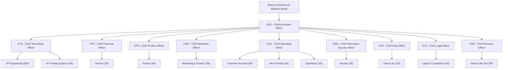

# Aegis Trading Terminal — Organizational Structure
## Complete Blueprint for a 1,000-Employee Global Trading Platform

---

## I. Executive Summary

This document defines the complete organizational structure for Aegis Trading Terminal as it scales from a startup to a 1,000-employee company serving 10,000+ users. The structure balances engineering depth with financial-services rigor, embedding compliance and risk management at every layer while maintaining the speed and innovation culture required to reach top-10 global trading platform status.

---

## II. Top-Level Org Chart



---

## III. C-Suite — 10 Executives

| # | Title | Direct Reports | Core Mandate |
|---|-------|----------------|--------------|
| 1 | **CEO** | All C-level | Vision, fundraising, board management, culture |
| 2 | **CTO** | VP Engineering, VP Trading Systems | Technology strategy, architecture, reliability |
| 3 | **CFO** | VP Finance | Financial planning, treasury, investor relations |
| 4 | **CPO** | VP Product, Head of Design | Product vision, roadmap, user experience |
| 5 | **CMO** | VP Marketing | Brand, growth, user acquisition |
| 6 | **COO** | VP Customer Success, VP HR, Dir Ops | Day-to-day operations, scaling |
| 7 | **CISO** | Director of Security | AppSec, SOC, compliance security |
| 8 | **CDO** | VP Data & AI | ML strategy, data governance, model accuracy |
| 9 | **CLO** | VP Legal & Compliance | Regulatory, IP, privacy/GDPR |
| 10 | **CRO** | VP Sales, VP Partnerships | Enterprise revenue, API/B2B monetization |

---

## IV. Department Breakdown

### 1. ENGINEERING — 300 headcount (VP Engineering → CTO)

| Team | Lead Title | HC | Responsibilities |
|------|-----------|-----|-----------------|
| Frontend Platform | Dir. Frontend | 55 | Dashboard UI, React migration, charting, dark-theme, RTL/i18n |
| Backend Services | Dir. Backend | 65 | API gateway, signal pipeline, data ingestion, auth/session |
| Infrastructure & DevOps | Dir. Infrastructure | 50 | Cloud (AWS/GCP), CI/CD, containers, monitoring, DR |
| Mobile Engineering | Dir. Mobile | 45 | iOS/Android apps, push notifications, mobile charting |
| QA & Test Engineering | Dir. QA | 40 | Test automation, regression, performance/load testing |
| Platform & Dev Tools | Sr. Eng Manager | 25 | Internal tooling, build systems, feature flags |
| Site Reliability (SRE) | SRE Manager | 20 | Uptime 99.95%, incident response, chaos engineering |

**KPIs:** 99.95% uptime | 20+ deploys/week | MTTR < 15min | 85%+ test coverage | P95 < 200ms

---

### 2. DATA & AI — 120 headcount (VP Data & AI → CDO)

| Team | Lead Title | HC | Responsibilities |
|------|-----------|-----|-----------------|
| ML Engineering | Dir. ML Engineering | 35 | Signal models, confidence calibration, A/B testing, Optuna |
| Data Science | Dir. Data Science | 30 | Prediction accuracy, regime models, portfolio optimization |
| Data Engineering | Dir. Data Engineering | 30 | Pipelines (Airflow), streaming (Kafka), JSON→PostgreSQL migration |
| NLP & Sentiment | Sr. NLP Manager | 25 | News sentiment, social scoring, multilingual NLP |

**KPIs:** 65%+ signal accuracy | < 50ms inference | < 5min sentiment freshness | < 15% false positive rate

---

### 3. TRADING SYSTEMS — 80 headcount (VP Trading Systems → CTO)

| Team | Lead Title | HC | Responsibilities |
|------|-----------|-----|-----------------|
| Signal Engine | Dir. Signal Engineering | 25 | Technical scoring (SMA, RSI, MACD, BB), confidence weighting |
| Execution Engine | Dir. Execution | 20 | Paper/live trading, order routing, broker integration (Alpaca) |
| Risk Management | Dir. Risk Engineering | 20 | Real-time risk, correlation matrix, drawdown breakers |
| Market Data | Sr. Market Data Mgr | 15 | yfinance → real-time feeds, price sanity, data normalization |

**KPIs:** < 2s signal generation | 100% execution accuracy | < 1s risk breach detection | < 30s data freshness

---

### 4. PRODUCT — 60 headcount (VP Product → CPO)

| Team | Lead Title | HC | Responsibilities |
|------|-----------|-----|-----------------|
| Product Management | Dir. PM | 20 | Roadmap, PRDs, feature gating, A/B tests |
| UX/UI Design | Dir. Design | 25 | Bloomberg aesthetic, design system, accessibility, RTL |
| User Research | Sr. UX Research Mgr | 15 | Usability testing, NPS surveys, persona development |

**KPIs:** NPS 50+ | 60%+ feature adoption | 8%+ free→pro conversion | < 3min time-to-first-value

---

### 5. FINANCE — 50 headcount (VP Finance → CFO)

| Team | Lead Title | HC | Responsibilities |
|------|-----------|-----|-----------------|
| Accounting | Controller | 15 | GAAP/IFRS, revenue recognition, audit prep |
| FP&A | Dir. FP&A | 15 | Budgeting, forecasting, unit economics (CAC, LTV) |
| Treasury | Treasury Mgr | 10 | Cash management, FX, liquidity planning |
| Billing & Payments | Billing Ops Mgr | 10 | Stripe integration, subscription lifecycle |

**KPIs:** Close < 5 days | Forecast within 5% | Billing errors < 0.01% | 18+ months runway modeled

---

### 6. LEGAL & COMPLIANCE — 40 headcount (VP Legal → CLO)

| Team | Lead Title | HC | Responsibilities |
|------|-----------|-----|-----------------|
| Regulatory Compliance | Dir. Regulatory | 15 | SEC/FINRA, MiFID II, FCA, BaFin compliance |
| Intellectual Property | IP Counsel | 8 | Patents, trademarks, open-source compliance |
| Privacy & Data Protection | Dir. Privacy | 10 | GDPR, CCPA, data subject requests |
| Licensing & Contracts | Sr. Contracts Mgr | 7 | Market data licensing, enterprise contracts |

**KPIs:** 100% audit pass | GDPR requests < 72h | Zero fines | Contract review < 3 days

---

### 7. MARKETING & GROWTH — 100 headcount (VP Marketing → CMO)

| Team | Lead Title | HC | Responsibilities |
|------|-----------|-----|-----------------|
| Brand & Creative | Dir. Brand | 20 | Visual assets, video, PR, thought leadership |
| Content Marketing | Dir. Content | 25 | Trading education, blog, YouTube, newsletters |
| SEO/SEM & Performance | Dir. Perf. Marketing | 20 | Paid acquisition, landing pages, attribution |
| Social Media & Community | Social Media Mgr | 15 | Twitter/X, Reddit, Discord, influencer partnerships |
| Partnerships & Affiliates | Dir. Partnerships | 20 | Broker partnerships, affiliate program, co-marketing |

**KPIs:** CAC < $25 self-serve | 15%+ organic growth MoM | 10K+ email subs/month | 20%+ partner revenue

---

### 8. SALES & BUSINESS DEV — 80 headcount (VP Sales → CRO)

| Team | Lead Title | HC | Responsibilities |
|------|-----------|-----|-----------------|
| Enterprise Sales | Dir. Enterprise | 30 | Hedge funds, prop firms, RIAs |
| Self-Serve & PLG | Dir. Growth Sales | 20 | Free→pro conversion, trial management |
| API & B2B | Dir. API Sales | 15 | Signal-as-a-service, white-label, data feeds |
| Sales Operations | Sales Ops Mgr | 10 | CRM, pipeline reporting, commission structures |
| Business Development | BD Manager | 5 | Strategic partnerships, M&A pipeline |

**KPIs:** 100%+ ARR growth YoY | 25%+ enterprise close rate | 8%+ free→paid | 120%+ net revenue retention

---

### 9. CUSTOMER SUCCESS — 80 headcount (VP CS → COO)

| Team | Lead Title | HC | Responsibilities |
|------|-----------|-----|-----------------|
| L1 Support | L1 Manager | 30 | First response, common issues, knowledge base |
| L2 Technical Support | L2 Manager | 20 | Signal questions, data discrepancies, bug repro |
| L3 Engineering Escalation | L3 Lead | 10 | Production incidents, root cause analysis |
| Onboarding & Education | Onboarding Mgr | 12 | Tutorials, webinars, first-time-to-value |
| Community & Advocacy | Community Mgr | 8 | Discord, beta programs, user testimonials |

**KPIs:** L1 response < 2h | 70%+ L1 resolution | CSAT 90%+ | Churn < 3% monthly | 5K+ community

---

### 10. SECURITY — 30 headcount (Dir. Security → CISO)

| Team | Lead Title | HC | Responsibilities |
|------|-----------|-----|-----------------|
| Application Security | AppSec Lead | 10 | Code review, SAST/DAST, OWASP Top 10 |
| Infrastructure Security | InfraSec Lead | 8 | Cloud security, secrets management, zero-trust |
| SOC | SOC Manager | 8 | 24/7 monitoring, SIEM, incident response |
| Penetration Testing | Pen Test Lead | 4 | Quarterly pen tests, bug bounty program |

**KPIs:** Critical vuln < 24h | MTTD < 15min | 100% security training | Zero unresolved pen test findings

---

### 11. HR & PEOPLE — 40 headcount (VP HR → COO)

| Team | Lead Title | HC | Responsibilities |
|------|-----------|-----|-----------------|
| Recruiting | Dir. Recruiting | 15 | Technical recruiting, employer branding, diversity |
| Learning & Development | L&D Manager | 8 | Engineering upskilling, trading domain education |
| Culture & EX | Culture Manager | 7 | Engagement surveys, DEI, remote policy |
| Compensation & Benefits | Total Rewards Mgr | 5 | Salary benchmarking, equity, benefits |
| People Operations | People Ops Mgr | 5 | HRIS, payroll, onboarding/offboarding |

**KPIs:** Time-to-fill < 45 days | 80%+ offer acceptance | 90%+ retention | 75%+ engagement

---

### 12. OPERATIONS — 20 headcount (Dir. Operations → COO)

| Team | Lead Title | HC | Responsibilities |
|------|-----------|-----|-----------------|
| IT Operations | IT Manager | 8 | Devices, SaaS licenses, VPN, helpdesk |
| Office Management | Office Manager | 5 | Facilities, vendors, workspace planning |
| Procurement | Procurement Lead | 4 | Vendor evaluation, cost optimization |
| Business Continuity | BC Coordinator | 3 | DR planning, crisis communication |

---

## V. Headcount Summary

| Department | HC | % |
|-----------|-----|---|
| Engineering | 300 | 30% |
| Data & AI | 120 | 12% |
| Marketing & Growth | 100 | 10% |
| Trading Systems | 80 | 8% |
| Sales & Business Dev | 80 | 8% |
| Customer Success | 80 | 8% |
| Product | 60 | 6% |
| Finance | 50 | 5% |
| HR & People | 40 | 4% |
| Legal & Compliance | 40 | 4% |
| Security | 30 | 3% |
| Operations | 20 | 2% |
| **TOTAL** | **1,000** | **100%** |

---

## VI. Full Reporting Structure

```
CEO
+-- CTO
|   +-- VP Engineering
|   |   +-- Dir. Frontend (55)
|   |   +-- Dir. Backend (65)
|   |   +-- Dir. Infrastructure (50)
|   |   +-- Dir. Mobile (45)
|   |   +-- Dir. QA (40)
|   |   +-- Sr. Eng Manager, Platform (25)
|   |   +-- SRE Manager (20)
|   +-- VP Trading Systems
|       +-- Dir. Signal Engineering (25)
|       +-- Dir. Execution (20)
|       +-- Dir. Risk Engineering (20)
|       +-- Sr. Market Data Manager (15)
|
+-- CDO
|   +-- VP Data & AI
|       +-- Dir. ML Engineering (35)
|       +-- Dir. Data Science (30)
|       +-- Dir. Data Engineering (30)
|       +-- Sr. NLP Manager (25)
|
+-- CPO
|   +-- VP Product
|       +-- Dir. Product Management (20)
|       +-- Dir. Design (25)
|       +-- Sr. User Research Manager (15)
|
+-- CFO
|   +-- VP Finance
|       +-- Controller (15)
|       +-- Dir. FP&A (15)
|       +-- Treasury Manager (10)
|       +-- Billing Ops Manager (10)
|
+-- CMO
|   +-- VP Marketing
|       +-- Dir. Brand (20)
|       +-- Dir. Content (25)
|       +-- Dir. Performance Marketing (20)
|       +-- Social Media Manager (15)
|       +-- Dir. Partnerships (20)
|
+-- CRO
|   +-- VP Sales
|       +-- Dir. Enterprise Sales (30)
|       +-- Dir. Growth Sales (20)
|       +-- Dir. API Sales (15)
|       +-- Sales Ops Manager (10)
|       +-- BD Manager (5)
|
+-- COO
|   +-- VP Customer Success
|   |   +-- L1 Support Manager (30)
|   |   +-- L2 Support Manager (20)
|   |   +-- L3 Lead (10)
|   |   +-- Onboarding Manager (12)
|   |   +-- Community Manager (8)
|   +-- VP HR
|   |   +-- Dir. Recruiting (15)
|   |   +-- L&D Manager (8)
|   |   +-- Culture Manager (7)
|   |   +-- Total Rewards Manager (5)
|   |   +-- People Ops Manager (5)
|   +-- Dir. Operations
|       +-- IT Manager (8)
|       +-- Office Manager (5)
|       +-- Procurement Lead (4)
|       +-- BC Coordinator (3)
|
+-- CISO
|   +-- Dir. Security
|       +-- AppSec Lead (10)
|       +-- InfraSec Lead (8)
|       +-- SOC Manager (8)
|       +-- Pen Test Lead (4)
|
+-- CLO
    +-- VP Legal & Compliance
        +-- Dir. Regulatory Affairs (15)
        +-- IP Counsel (8)
        +-- Dir. Privacy (10)
        +-- Sr. Contracts Manager (7)
```

---

## VII. Cross-Functional Squads

### Squad 1: Signal Accuracy Squad
**Mission:** Improve prediction hit rate toward 75%+
- Signal Engineer (Trading) + ML Engineers x2 (AI) + Data Scientist (AI) + NLP Engineer (AI) + QA Engineer (Eng) + PM (Product)
- **Owns:** Signal accuracy rate, false positive rate, confidence calibration

### Squad 2: Reliability & Performance Squad
**Mission:** 99.95% uptime, sub-200ms response
- SRE Lead + Backend Eng x2 + Infra Eng x2 + Data Eng + SOC Analyst + L3 Support
- **Owns:** Uptime, MTTR, P95 latency, error rate

### Squad 3: Growth & Conversion Squad
**Mission:** 8%+ free-to-pro monthly conversion
- Growth PM + Frontend Eng x2 + UX Designer + Performance Marketer + Data Scientist + Growth Sales
- **Owns:** Conversion rate, time-to-first-value, trial activation, CAC

### Squad 4: Compliance & Risk Squad
**Mission:** Regulatory readiness across all jurisdictions
- Dir. Regulatory + Risk Engineer + AppSec Eng + Privacy Eng + Backend Eng + PM
- **Owns:** Audit readiness, zero fines, compliance feature coverage

### Squad 5: Data Quality & Integrity Squad
**Mission:** All market data meets quality thresholds
- Dir. Data Eng + Market Data Eng x2 + Data Eng x2 + QA Eng + L2 Support
- **Owns:** Price sanity pass rate, data freshness SLA, data gap incidents

### Squad 6: Internationalization Squad
**Mission:** 10+ languages, full localization
- Sr. PM + Frontend Eng x2 + NLP Eng + UX Designer + Content Writer + Legal
- **Owns:** Language coverage, translation accuracy, regional growth, RTL bugs

### Squad 7: Enterprise Readiness Squad
**Mission:** SSO, audit logs, custom dashboards, SLAs
- Dir. API Sales + Backend Eng x2 + Infra Eng + PM + Security Eng + Enterprise Sales
- **Owns:** Enterprise feature completeness, SOC 2 readiness, API SLA

---

## VIII. Advisory Board

| Seat | Profile | Value |
|------|---------|-------|
| Quantitative Finance | Former CTO at Citadel/Two Sigma | Signal credibility, institutional insights |
| Retail Trading | Former exec at Robinhood/eToro | Product-market fit, regulatory navigation |
| AI/ML in Finance | Stanford HAI / MIT CSAIL director | Model architecture, talent pipeline |
| Financial Regulation | Former SEC/FINRA commissioner | Regulatory strategy, government relationships |
| Growth-Stage Fintech | CEO who scaled fintech to IPO | Operational playbook, fundraising |
| Cybersecurity | Former CISO at major bank | Security posture, threat landscape |
| Data & Privacy | Former CPO at tech company | GDPR strategy, user trust |
| Developer Tools | Former VP at Bloomberg/Refinitiv | API monetization, B2B sales |

---

## IX. Design Principles

1. **Engineering-Heavy (42% technical):** 500 of 1000 are engineering/data/trading — we're a tech company in finance
2. **Dual CTO Reporting:** VP Engineering + VP Trading Systems both under CTO for architectural coherence
3. **CDO Owns AI:** Data & AI reports separately to prevent ML being subordinated to feature delivery
4. **Revenue Under CRO:** Enterprise, self-serve, and API sales unified to prevent internal competition
5. **Compliance by Design:** CLO reports directly to CEO, not buried under COO/CFO
6. **Security as First-Class:** CISO reports to CEO, AppSec has production release veto
7. **Squad Model:** 7 standing cross-functional squads prevent critical issues from falling between orgs
